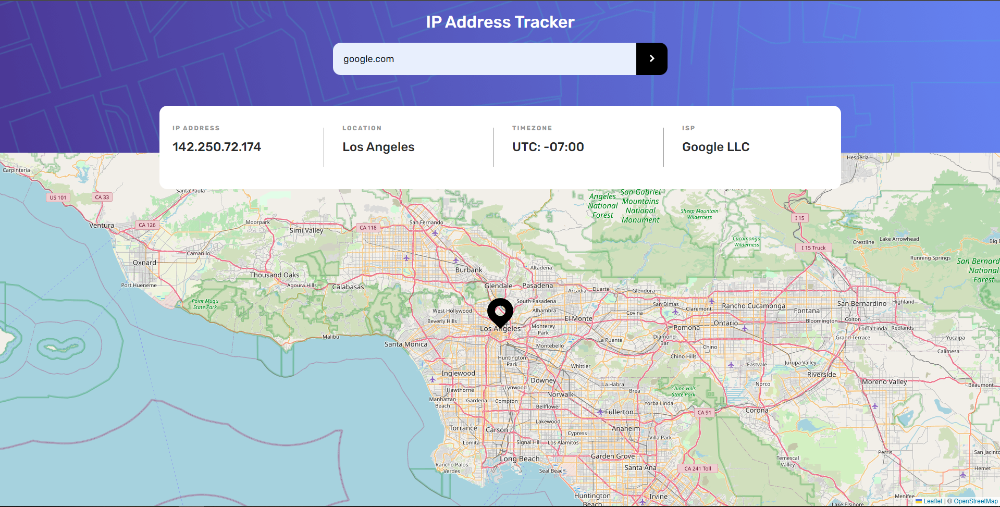
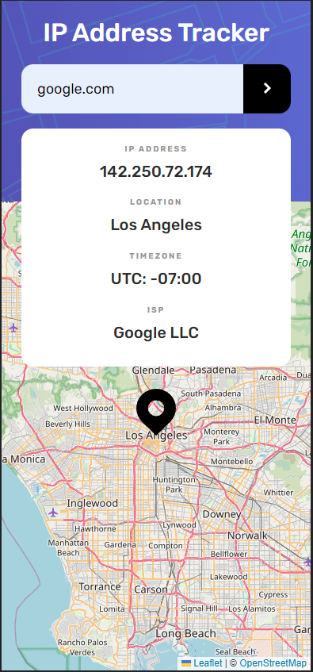

# Frontend Mentor - IP address tracker solution

This is a solution to the [IP address tracker challenge on Frontend Mentor](https://www.frontendmentor.io/challenges/ip-address-tracker-I8-0yYAH0). Frontend Mentor challenges help you improve your coding skills by building realistic projects.

## Table of contents

- [Overview](#overview)
  - [The challenge](#the-challenge)
  - [Screenshot](#screenshot)
  - [Links](#links)
- [My process](#my-process)
  - [Built with](#built-with)
  - [What I learned](#what-i-learned)
  - [Continued development](#continued-development)
  - [Useful resources](#useful-resources)
- [Author](#author)
- [Acknowledgments](#acknowledgments)

**Note: Delete this note and update the table of contents based on what sections you keep.**

## Overview

### The challenge

Users should be able to:

- View the optimal layout for each page depending on their device's screen size
- See hover states for all interactive elements on the page
- See their own IP address on the map on the initial page load
- Search for any IP addresses or domains and see the key information and location

### Screenshot
## Desktop

## Mobile

### Links

- Solution URL: [Repository](https://github.com/Isma1306/IP-Address-Tracker)
- Live Site URL: [Live](https://isma1306.github.io/IP-Address-Tracker/)

## My process

### Built with

- Semantic HTML5 markup
- SCSS custom properties
- Flexbox
- Mobile-first workflow
- [Angular](https://angular.io/) - JS library

### What I learned

I have learned the basics of SCSS and how to implement them to Angular.
Also, how to use and set leaflet to make a good looking map.
Finally I tried to manage all the information on the services and only used the components with the async pipe to make them as simple as possible.

### Useful resources

- [IP Geolocation API by IPify](https://geo.ipify.org/)
- [LeafletJS](https://leafletjs.com/)
- [StackOverflow](https://stackoverflow.com/questions/5284147/validating-ipv4-addresses-with-regexp) - here I found hwo to filter ip addresses from domains with regex. Very interesting discussion.

## Author

- Website - [Ismael Carrea](https://github.com/Isma1306/)
- Frontend Mentor - [@isma1306](https://www.frontendmentor.io/profile/Isma1306)

